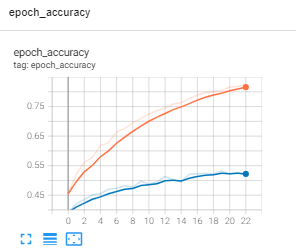
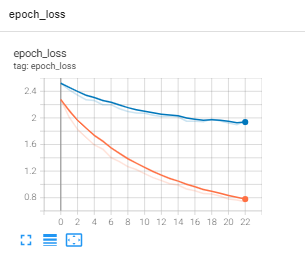

# Report - Model Evaluation with Detectron

To improve even more the performance of the model I decided to crop the images as to remove the background that was making noise in the images.
So I ran another experiment with the same configuration yml file of my last experiment (using weights from exp_011, L2 regularizer, learning rate of 0.0005), and using this new set of cropped images. The results were even much better, val_loss: 1.9542 and val_accyracy: 0.5319, but the model was still overfitting. Here are the graphics of the metrics of this last experiment:

The result of accuracy in test dataset was of 0.4844.

I made another experiment training with imagenet weights and defreezing the las 30 layer of the base model, but the results were very similar.

